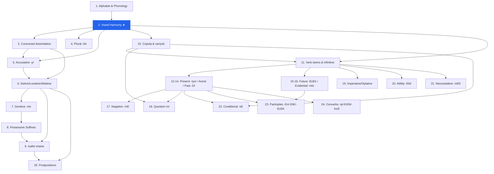
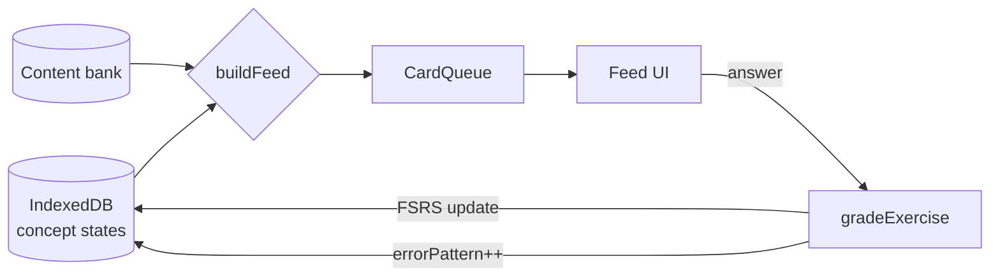
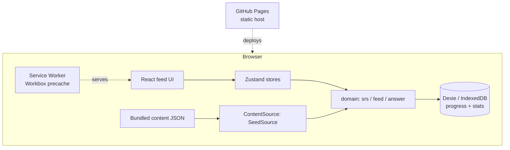

# Akış — Project Definition Report

> A mobile-first PWA that replaces mindless Instagram scrolling with a structured, algorithmically-ordered Turkish grammar feed — rules first, then pattern drilling, vocabulary through exposure. Spaced-repetition driven, fully precached, installable on iPhone Safari without the App Store.

**Status:** Planning → Phase 1 scaffolding
**Owner:** Raneem
**Date:** 2026-06-29
**Scope of this revision:** Precached content only. No AI generation, no backend, no API keys.

---

## Table of Contents

1. [Executive Summary](#1-executive-summary)
2. [Vision & Learning Philosophy](#2-vision--learning-philosophy)
3. [Problem Statement, Goals & Non-Goals](#3-problem-statement-goals--non-goals)
4. [Scope](#4-scope)
5. [Learning Design — Curriculum](#5-learning-design--curriculum)
6. [Content Data Model & JSON Schema](#6-content-data-model--json-schema)
7. [Spaced Repetition Engine](#7-spaced-repetition-engine)
8. [The Feed — UX & Interaction](#8-the-feed--ux--interaction)
9. [Architecture & Tech Stack](#9-architecture--tech-stack)
10. [PWA & Hosting](#10-pwa--hosting)
11. [File / Folder Architecture](#11-file--folder-architecture)
12. [Build Plan](#12-build-plan)
13. [Risks & Mitigations](#13-risks--mitigations)
14. [Success Criteria](#14-success-criteria)
15. [Appendix](#15-appendix)

---

## 1. Executive Summary

Akış is a single-user, mobile-first Progressive Web App that turns the habit of scrolling a social feed into structured Turkish language acquisition. Instead of an infinite stream of disposable posts, the user scrolls a vertical feed of **bite-sized cards** — each either a *mini-lesson* (a grammatical concept shown as a clean formula with examples) or an *exercise* (drilling that concept). The feed is not random: a real spaced-repetition engine (FSRS) orders it from the user's per-concept mastery state, interleaving new material with due reviews and surfacing weak points.

The pedagogy is deliberately German-style and structural: **introduce one rule at a time, show it as a formula, drill it immediately, and let vocabulary emerge through repeated exposure to correct structures** — never translation-first vocabulary dumps. Turkish is an ideal target because it is agglutinative and rule-regular, so a "formula → drill" approach genuinely works.

This revision is scoped to **fully precached content**: a human-reviewed, validated bank of lessons and graded exercises ships inside the build. There is no backend, no API key, and no network dependency for core use — the app is a static site deployable to GitHub Pages and installable as a PWA. All user progress lives in IndexedDB. The architecture leaves a clean seam (`ContentSource`) so dynamic AI generation can be added later without rework.

---

## 2. Vision & Learning Philosophy

The app encodes a specific theory of how an adult structural learner acquires a grammatically-regular language:

- **Rules before words.** Each concept is introduced as a *formula* (analogous to German case tables), not as a vocabulary list. Example: the accusative suffix is taught as `noun + -(y)I → definite object`, with the harmony variants laid out as a small table.
- **Immediate drilling.** A rule is followed at once by exercises that exercise *that rule*, at graded difficulty.
- **Vocabulary through exposure.** Words are never the unit of study. They recur inside correct sentences across many exercises until they are simply known. Exercises draw from a controlled, growing vocabulary so the learner is never ambushed by unknown words while trying to learn a grammar point.
- **Explanatory feedback, always.** Every answer — right or wrong — is followed by the *grammatical reason* for the correct answer, not a bare ✓/✗. This is the core differentiator from flashcard apps.
- **The feed replaces the scroll.** Cards are designed to feel quick (30 s–2 min), the scroll is buttery, and the ordering is intelligent — so the dopamine loop of "just one more" is redirected toward learning.

**Why Turkish suits this.** Turkish morphology is overwhelmingly rule-regular: vowel harmony, consonant assimilation, and the case/tense suffix system are deterministic given a few rules. This means (a) formulas are genuinely predictive, not approximations, and (b) the app can *verify answers in code* with a deterministic suffix engine, which is a strong quality lever for content.

---

## 3. Problem Statement, Goals & Non-Goals

### Problem

Existing language apps optimize for streaks and gamified vocabulary, not for a learner who thinks in grammatical structure. They are translation-first, rule-light, and their "feed" (where one exists) is not driven by a real memory model. Meanwhile the user's actual competing behavior is *Instagram scrolling* — a low-friction, high-frequency habit.

### Goals (measurable)

| # | Goal | Measure |
|---|------|---------|
| G1 | Replace the scroll habit | A session feels as frictionless as social scrolling; a card resolves in 30 s–2 min |
| G2 | Teach structurally | Every concept ships with 1 lesson formula + ≥10–15 graded exercises |
| G3 | Real spaced repetition | FSRS (not a fake interval scheme) schedules per-concept reviews; feed order is derived from it |
| G4 | Explanatory feedback | 100% of exercises show the grammatical rule on answer, correct or not |
| G5 | Offline-capable PWA | Installs to iPhone home screen; core use works with no network |
| G6 | Extensible content | Adding a concept = adding validated JSON; no code change |

### Non-Goals (this revision)

- ❌ AI-generated or dynamic exercises (deferred — see [Appendix](#155-deferred-dynamic-generation))
- ❌ Any backend, account system, or cloud sync
- ❌ Multi-user support
- ❌ Speech *production* grading (TTS playback is a stretch; speech recognition is out)
- ❌ Native app / App Store distribution

---

## 4. Scope

| In scope | Stretch (if time) | Out of scope |
|---|---|---|
| Vertical card feed (lessons + exercises) | Text-to-speech on Turkish (Web Speech API) | AI generation of content |
| Precached, validated content bank | — | Backend / API / proxy |
| FSRS spaced-repetition engine | Audio-recognition exercise format | Accounts / sync |
| Feed builder (interleave new + due + weak points) | JSON export/import of progress (storage safety valve) | Speech-production scoring |
| IndexedDB progress + content store | Dark mode / theming polish | Non-Turkish languages |
| Exercise formats: fill-blank, multiple-choice, suffix-match, reorder, short translation | | |
| Explanatory feedback engine | | |
| Streaks, session stats, weak-point surfacing | | |
| Flashcard **deck** review mode (core) | | |
| Installable PWA on GitHub Pages | | |

---

## 5. Learning Design — Curriculum

### 5.1 Sequencing principle

**Vowel harmony is the master key.** Nearly every Turkish suffix changes shape according to it, so it is over-learned before any case or tense. After that: **nouns before verbs** (Turkish leans on nominal suffixes first), then **morphology before syntax**. Notation used on cards: `A` = {a, e} (2-way harmony), `I` = {ı, i, u, ü} (4-way), parenthesized letters are buffer consonants, `D` = {d, t}.

### 5.2 Dependency graph



### 5.3 Concept table

| # | Unit | Formula / core rule | Prereqs |
|---|------|---------------------|---------|
| 1 | Alphabet & phonology | 29 letters; ı vs i, ö, ü, ç, ş, ğ, soft-g | — |
| 2 | **Vowel harmony** | back/front + rounded/unrounded → `A` 2-way, `I` 4-way | 1 |
| 3 | Consonant assimilation | final p/ç/t/k → b/c/d/ğ before vowel; d/t harmony | 2 |
| 4 | Plural | `-lAr` (ev-ler, kapı-lar) | 2 |
| 5 | Accusative | `-(y)I` definite object | 2,3 |
| 6 | Dative / Locative / Ablative | `-(y)A` / `-DA` / `-DAn` | 2,3 |
| 7 | Genitive | `-(n)In` | 2,3 |
| 8 | Possessive suffixes | benim ev-**im**, senin ev-**in** … | 2,3 |
| 9 | İzafet (gen-poss chains) | X-`In` Y-`(s)I` (Türkiye'nin başkenti) | 6,7,8 |
| 10 | Copula / predicate | `-(y)Im, -sIn, -DIr…`; var / yok | 2 |
| 11 | Verb stems & infinitive | `-mAk`; stem extraction | 2,3 |
| 12 | Present continuous | `-Iyor` | 11 |
| 13 | Aorist (habitual) | `-Ir / -Ar` | 11 |
| 14 | Definite past | `-DI` | 11 |
| 15 | Future | `-(y)AcAk` | 11 |
| 16 | Evidential past | `-mIş` | 11,14 |
| 17 | Negation | verb `-mA`, nominal değil | 12–16 |
| 18 | Question particle | `mI` (separate word, harmonizes) | 10,12 |
| 19 | Imperative / optative | bare stem, `-(y)AyIm, -sIn` | 11 |
| 20 | Ability / possibility | `-(y)Abil` / `-(y)A…mA` | 11,17 |
| 21 | Necessitative | `-mAlI` | 11 |
| 22 | Conditional | `-(y)sA` / `-sA` | 10,14 |
| 23 | Participles | subject `-(y)An`, object `-DIK`, future `-(y)AcAK` | 14,15 |
| 24 | Converbs | `-(y)Ip`, `-(y)ErEk`, `-(y)IncA` | 14 |
| 25 | Postpositions | ile, için, gibi, kadar + case government | 6,9 |

These group into 5 tiers: **Phonology (1–3) → Noun morphology (4–9) → Predication (10) → Verb system (11–18) → Modality & complex syntax (19–25).**

### 5.4 Difficulty grading

Each concept ships exercises across four levels, and the SRS samples from them as mastery grows:

| Level | Cognitive demand | Typical formats |
|---|---|---|
| L1 | Recognition | multiple choice |
| L2 | Cued production | suffix-match, fill-blank *with hint* |
| L3 | Free production | fill-blank, reorder |
| L4 | Integration | short translation mixing prior concepts |

Every exercise is also tagged with the **error type it targets** (e.g. `wrong_suffix_vowel`, `missing_buffer_y`), so the weak-point surfacing can pull the *existing* cards that drill a specific recurring mistake.

---

## 6. Content Data Model & JSON Schema

Content (static, versioned, shipped with the build) is cleanly separated from user state (IndexedDB). This separation is the single most important architectural decision — curriculum can be updated without touching progress.

### 6.1 Concept

```jsonc
{
  "id": "acc-case",
  "tier": 2,
  "order": 5,
  "title": "The Accusative Suffix",
  "prereqs": ["vowel-harmony", "consonant-assimilation"],
  "tags": ["case", "noun"]
}
```

### 6.2 Lesson card

```jsonc
{
  "id": "acc-case.lesson",
  "conceptId": "acc-case",
  "type": "lesson",
  "formula": "noun + -(y)I   →   definite object",
  "body": [
    { "kind": "rule", "md": "Use the accusative only for a **specific** object." },
    { "kind": "table", "headers": ["last vowel", "suffix"],
      "rows": [["a/ı","ı"],["e/i","i"],["o/u","u"],["ö/ü","ü"]] },
    { "kind": "example", "tr": "Kitabı okudum.", "gloss": "I read the book.",
      "highlight": [{ "span": [5,7], "note": "-ı accusative; p→b softening" }] }
  ]
}
```

### 6.3 Exercise card (discriminated union on `format`)

```jsonc
{
  "id": "acc-case.ex.012",
  "conceptId": "acc-case",
  "type": "exercise",
  "format": "fill_blank",          // | multiple_choice | reorder | suffix_match | translate | audio
  "difficulty": 3,                  // 1–4, maps to L1–L4
  "prompt": "Ali ___ gördüm.",
  "answer": ["Ali'yi"],
  "alternates": ["Aliyi"],          // accepted normalized variants
  "distractors": ["Ali'ye", "Ali", "Ali'de"],   // for MC / suffix tiles
  "explanation": {
    "rule": "Proper noun + accusative -(y)I; buffer -y- after a vowel.",
    "why": "‘Ali’ is a specific, definite object of ‘gördüm’."
  },
  "audio": { "tts": "Ali'yi gördüm." }   // optional; generated at runtime, not stored
}
```

### 6.4 Validation

Content ships with **Zod schemas** and a `validate-content` script run in pre-commit/CI, so a malformed card can never reach the feed. Beyond schema, a **deterministic Turkish suffix checker** verifies that stated answers are actually grammatically correct (vowel harmony + buffer consonants are rule-computable) and that exercise vocabulary stays within the introduced allowlist. Answer-checking at runtime uses a normalizer (lowercase, fold apostrophe variants, Turkish-aware casefold for İ/ı) plus Levenshtein distance ≤1 to distinguish "typo" from "wrong rule" in feedback.

---

## 7. Spaced Repetition Engine

### 7.1 Algorithm choice: FSRS, not SM-2

The requirement is "SM-2 or better." **FSRS is the better** — it models memory as separable *stability* and *difficulty*, is empirically far more accurate than SM-2, grades on the same Again/Hard/Good/Easy scale, and has a clean open-source TS reference (`ts-fsrs`). We vendor `ts-fsrs` behind a `Scheduler` interface, keeping an SM-2 implementation behind the same interface for comparison.

### 7.2 The reviewable unit is the *concept*

Scheduling per-exercise would fragment a single grammar rule across dozens of independent schedules. Instead there is **one memory state per concept**; exercises are *samples* that produce grades for that concept.

```jsonc
// userConceptState  (IndexedDB store: "srs")
{
  "conceptId": "acc-case",
  "status": "learning",      // new | learning | review | mastered
  "stability": 4.2,
  "difficulty": 6.1,
  "due": "2026-06-25T08:00:00Z",
  "lastReview": "2026-06-23T...",
  "reps": 7,
  "lapses": 1,
  "errorPatterns": { "wrong_suffix_vowel": 3, "missing_buffer_y": 1 }
}
```

### 7.3 Grade derivation

| Exercise result | FSRS rating |
|---|---|
| Correct, fast, no hint | Easy |
| Correct | Good |
| Correct after hint, or with a typo | Hard |
| Incorrect | Again |

Each result updates the concept's FSRS state and increments the relevant `errorPattern` bucket.

### 7.4 How it drives the feed

`buildFeed(srsStates, content, now, sessionConfig) → CardQueue` is a **pure, deterministic function** (trivially testable):

1. **Due reviews** — concepts with `due ≤ now`, sorted by overdue-ness, capped (≤60% of a session) so reviews never crowd out progress.
2. **New material** — the next concept whose prereqs are all `mastered`/`review`, gated by the dependency graph so a tense never precedes its harmony foundation.
3. **Interleaving** — weave new lesson + its L1/L2 exercises between due reviews at a deterministic ratio (≈2 reviews : 1 new), mixing concepts (desirable difficulty) rather than blocking.
4. **Weak-point injection** — concepts with high `lapses` or a spiking `errorPattern` get extra exercises *of the targeting format* surfaced ahead of schedule.



---

## 8. The Feed — UX & Interaction

### 8.1 Component tree

```
<App>
 └ <FeedView>
    ├ <FeedEngine>            // holds CardQueue, hands one card at a time
    ├ <CardScroller>         // vertical snap-scroll container (3 cards mounted, recycled)
    │   └ <FeedCard>         // one full-viewport (100dvh) snap slide
    │       ├ <LessonCard>    // formula + table + examples + TTS button
    │       └ <ExerciseCard>  // dispatches by format ↓
    │           ├ <FillBlank> <MultipleChoice> <Reorder>
    │           ├ <SuffixMatch> <Translate> <AudioRecognize>
    │           └ <FeedbackSheet>   // slides up: result + grammatical explanation
    ├ <ProgressHUD>          // streak, session count, mastery ring (top bar)
    └ <SessionSummary>       // end-of-session stats card
```

### 8.2 Scroll & animation

- **CSS `scroll-snap-type: y mandatory`** with full-viewport slides → native, GPU-accelerated, buttery snap on iOS Safari with zero JS scroll handling.
- **Advance lock:** an unanswered exercise blocks snapping to the next card (overscroll guard) so feedback is never skipped.
- **Virtualization:** only ~3 cards mounted at once (prev/current/next), recycled as the engine dequeues — scales to hundreds of cards.
- **Framer Motion** for the feedback sheet spring slide-up, correct/incorrect color wash, and tile drag in reorder/suffix-match. Transforms/opacity only (compositor-friendly). Respects `prefers-reduced-motion`.

### 8.3 Feedback mechanics

Answer → immediate visual (green/red wash) → `<FeedbackSheet>` slides up with the **grammatical rule shown even when correct**. "Got it" dismisses and unlocks the next snap. IndexedDB writes are debounced out of the render path.

### 8.4 State management

**Zustand + Immer.** One `feedStore` (queue, card index, session stats), one `srsStore` (mastery, due counts), one `settingsStore`. Chosen over Redux (state is small, mostly local) and Context (the feed re-renders hot).

---

## 9. Architecture & Tech Stack



| Layer | Choice | Justification |
|---|---|---|
| Framework | **React 18 + TypeScript + Vite** | Best ecosystem fit for everything else we need (Dexie, Framer Motion, vite-plugin-pwa, ts-fsrs all first-class). The performance levers — CSS snap-scroll, IndexedDB — are framework-independent, so ecosystem maturity wins over Svelte's marginal leanness. |
| State | **Zustand + Immer** | Minimal boilerplate, selective re-renders, no provider hell. |
| Persistence | **Dexie.js (IndexedDB)** | Real indexes, transactions, migrations, async — meets the "handle real volume" requirement; hand-rolled IDB is error-prone. |
| SRS | **ts-fsrs** behind a `Scheduler` interface | Proven FSRS impl; interface allows SM-2 comparison. |
| Animation | **Framer Motion** | Declarative springs, drag gestures, reduced-motion built in. |
| Content validation | **Zod** + custom Turkish suffix checker | Schema + grammatical correctness guarantees. |
| PWA | **vite-plugin-pwa (Workbox)** | Generates SW + precache manifest, handles update prompts. |
| TTS (stretch) | **Web Speech API** (`tr-TR`) | Zero-cost, no key; feature-detected and degrades gracefully. |
| Testing | **Vitest** + Testing Library; **Playwright** for the feed flow | Pure SRS/feed/answer logic is unit-tested hard. |

The hard line between `domain/` (pure, 100% testable, zero React) and `features/` (React) is what keeps the app scalable as content grows.

---

## 10. PWA & Hosting

- **Host: GitHub Pages.** The build is static files. Set Vite `base` to the repo path. No server code — consistent with the no-backend scope.
- **Manifest:** `display: standalone`, portrait, theme/background colors, maskable icons, plus the legacy iOS `<meta>` tags and `apple-touch-icon` (iOS ignores parts of the manifest).
- **Service Worker (Workbox):** precache the app shell **and** all content JSON, so the app is fully functional offline after first load. There are no API routes to cache (no backend). Runtime-only feature: TTS (online, feature-detected).
- **Updates:** `registerType: 'prompt'` → "New content available — refresh" toast, avoiding mid-session disruption.
- **iOS storage caveats:** IndexedDB can be evicted under storage pressure; call `navigator.storage.persist()` to request durability, and provide **JSON export/import of progress** as a safety valve (stretch, but design for it early).

---

## 11. File / Folder Architecture

```
Akis/
  PDR.md                     # this document
  README.md                  # quickstart + deploy
  docs/
    CURRICULUM.md            # full concept specs + formulas (authoring source of truth)
    CONTENT_AUTHORING.md     # how to write & validate a card
  src/
    content/                 # static curriculum (versioned, precached)
      concepts.json
      lessons/acc-case.json …
      exercises/acc-case.json …
      schema/                # Zod schemas + validate script
      source/
        ContentSource.ts     # interface: getLesson, getExercises
        SeedSource.ts        # reads bundled JSON (the only impl for now)
    domain/                  # pure logic, zero React, 100% tested
      srs/   scheduler.ts (FSRS) · grade.ts · scheduler.types.ts
      feed/  buildFeed.ts · interleave.ts · prereqGate.ts
      answer/ normalize.ts · check.ts (Levenshtein, TR casefold)
      turkish/ harmony.ts · suffix.ts   # deterministic engine (validation + checking)
    data/                    # Dexie
      db.ts · repos/{srsRepo,statsRepo} · migrations.ts
    store/  feedStore.ts · srsStore.ts · settingsStore.ts
    features/
      feed/    FeedView · CardScroller · FeedCard · ProgressHUD · SessionSummary
      lesson/  LessonCard · FormulaBlock · ExampleLine
      exercise/ ExerciseCard · formats/* · FeedbackSheet
      review/  DeckView (stretch flashcard mode)
      stats/   StatsView · WeakPoints
    audio/   tts.ts
    pwa/     sw registration · update prompt
    ui/      primitives (Button, Sheet, Ring, Tile)
    app/     App.tsx · router · theme
  public/   manifest.webmanifest · icons (maskable) · iOS splash
```

---

## 12. Build Plan

Phased, with a guaranteed-usable milestone at the end of each phase.

### Phase 0 — Scaffold (½ day)
Vite + React + TS project; Zod content schema + `validate-content` script; Dexie DB skeleton; CI (typecheck + test + content validation). **Milestone:** repo builds, deploys an empty shell to GitHub Pages.

### Phase 1 — The feed works (vertical slice)
- Author **Units 1–4** (alphabet, vowel harmony, consonant assimilation, plural) — harmony is the hero lesson.
- `CardScroller` snap-scroll; `LessonCard`; 3 exercise formats (multiple-choice, fill-blank, suffix-match); answer normalizer; explanatory `FeedbackSheet`.
- **Linear feed order, no SRS yet.**
- **Milestone:** it *feels* like a feed and teaches vowel harmony end-to-end in Safari.

### Phase 2 — Intelligence
- Dexie repos; vendor `ts-fsrs` behind `Scheduler`; grade derivation; `buildFeed` with prereq gating + review/new interleaving + weak-point injection; wire feed to live SRS state.
- Streaks, session stats, `WeakPoints` view.
- **`DeckView` flashcard review mode** (pulled into core) — a separate spaced-repetition deck view reading the same `srs` store.
- Author **Units 5–18** (cases through questions).
- Hard unit tests on SRS + feed builder.
- **Milestone:** the feed is algorithmically ordered from mastery; reviews come due and surface.

### Phase 3 — Polish & stretch
- Reorder + short-translation formats; Framer Motion pass (springs, drag, reduced-motion); full a11y/keyboard.
- Web Speech TTS on lessons/exercises; audio-recognition format.
- Progress export/import (storage safety valve).
- Author **Units 19–25**.
- PWA hardening (manifest/iOS meta, `storage.persist()`, update toast); performance pass (virtualization audit, IDB write debouncing).
- **Milestone:** complete curriculum, installable, polished, offline-robust.

---

## 13. Risks & Mitigations

| Risk | Likelihood | Impact | Mitigation |
|---|---|---|---|
| Content is grammatically wrong | Med | High | Deterministic Turkish suffix checker validates every card in CI; human review of the seed bank |
| iOS Safari evicts IndexedDB | Med | High | `navigator.storage.persist()`; JSON export/import safety valve; content is also in the precache so only progress is at risk |
| Snap-scroll + advance-lock feels janky on iOS | Med | Med | Pure CSS snap (no JS scroll handling); prototype the lock in Phase 1 before building formats |
| FSRS misconfiguration produces bad intervals | Low | Med | Vendor proven `ts-fsrs`; unit-test scheduler against known vectors; SM-2 fallback behind same interface |
| Authoring 25 units is slow | Med | Med | Author offline with Opus + validate in CI; ship phases incrementally (app is usable from Phase 1) |
| Scope creep back toward dynamic generation | Med | Low | `ContentSource` seam isolates it; explicitly deferred in this PDR |
| GitHub Pages base-path / routing breakage | Low | Low | Set Vite `base`; use hash or single-view routing; test the deployed build early |

---

## 14. Success Criteria

The project is successful when:

1. The user opens Akış instead of Instagram and scrolls a feed of Turkish cards that *feels* as smooth as a social feed.
2. Each grammar concept is taught as a formula, then drilled, with explanatory feedback on every answer.
3. The feed order visibly adapts: new concepts unlock only after prerequisites, reviews come due on an FSRS schedule, and repeated mistakes resurface targeted drills.
4. The app installs to the iPhone home screen and works with no network for core study.
5. Adding a new concept requires only authoring + validating JSON — no code change.

**Demo story:** Install to home screen → open to a vowel-harmony lesson card → drill it → deliberately make the same suffix error twice → watch the engine resurface a targeted drill and the weak-point view flag it → close and reopen days later to find reviews due.

---

## 15. Appendix

### 15.1 Turkish suffix notation (used throughout)

- `A` → {a, e} (2-way, by frontness)
- `I` → {ı, i, u, ü} (4-way, by frontness + rounding)
- `D` → {d, t} (by preceding consonant voicing)
- `(y)`, `(n)`, `(s)` → buffer consonants inserted after vowels
- Final `p/ç/t/k` soften to `b/c/d/ğ` before a vowel-initial suffix

### 15.2 Exercise formats

| Format | Interaction | Levels |
|---|---|---|
| `multiple_choice` | tap one of N options | L1 |
| `suffix_match` | drag/select the correct suffix tile | L2 |
| `fill_blank` | type the missing form (hint at L2) | L2–L3 |
| `reorder` | drag scrambled words into order | L3 |
| `translate` | short translation, normalized check | L4 |
| `audio` *(stretch)* | identify the heard form | L1–L2 |

### 15.3 IndexedDB stores

| Store | Key | Contents |
|---|---|---|
| `srs` | `conceptId` | FSRS state + errorPatterns per concept |
| `stats` | `date` | per-day session stats, streak data |
| `settings` | singleton | preferences, TTS on/off, last session |
| `attempts` *(optional)* | auto | raw answer log for analytics/debug |

Content is **not** stored in IndexedDB in this revision — it ships in the bundle and is read by `SeedSource`. (The `GeneratedCache` store is reserved for the deferred generation feature.)

### 15.4 Content authoring workflow

1. Write the concept spec + formula in `docs/CURRICULUM.md`.
2. Author the lesson + 10–15 graded exercises as JSON under `src/content/`.
3. Run `validate-content`: Zod schema check **+** deterministic Turkish suffix verification **+** vocabulary-allowlist check.
4. Human review for naturalness and pedagogy.
5. Commit. CI re-validates on every push.

### 15.5 Deferred: dynamic generation

Out of scope now, but the architecture preserves the seam. If added later:
- A second `ContentSource` implementation (`AiGenerator`) sits behind the same interface.
- A `GeneratedCache` IndexedDB store persists validated generations so each is produced once.
- Triggers: reactive (a spiking `errorPattern` → generate targeted drills) and proactive (a due concept running low on unused exercises → background prefetch).
- Reliability levers already specified: structured outputs against the exercise schema, prompt-cached grammar prefix, and the *same* deterministic suffix checker gating generated cards.
- Key custody (BYOK in IndexedDB vs. a serverless proxy) is the only open decision, and it does not affect any code outside `AiGenerator`.

### 15.6 Resolved decisions (2026-06-29)

1. **App name:** **Akış** — confirmed.
2. **UI language:** **English** explanations and labels.
3. **Flashcard deck review mode:** **pulled into core** (Phase 2, not a stretch).
4. **Phonetic scaffolding:** **light** — introduce each letter/sound once with a minimal cue; do not repeat IPA or pronunciation notes on every later card.
